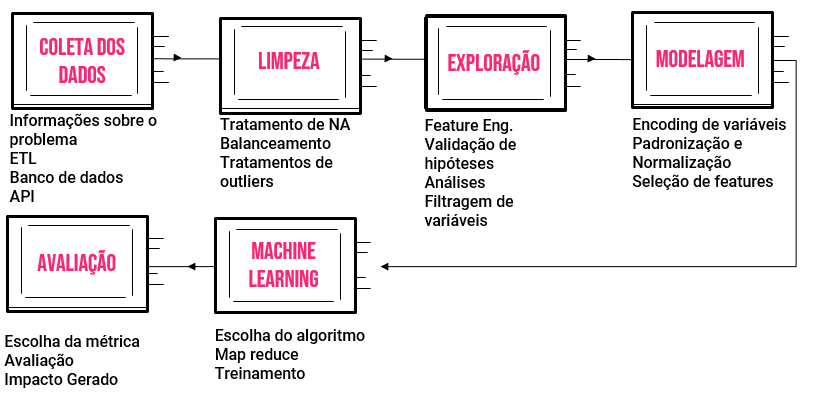

---
output:
  xaringan::moon_reader:
    css: [default, rutgers, shinobi]
    lib_dir: libs
    nature:
      highlightStyle: github
      highlightLines: true
      countIncrementalSlides: false
---
class: center, middle
#VISÃO GERAL DA CIÊNCIA DE DADOS

Gessyca Moreira

.center[[CDEC](https://bendeivide.github.io/cdec/)]
---
class: left, top
#Fundamentos da ciência de dados

--
.center[De uma forma totalmente contrária ao que muitas pessoas pensam ao escutar este termo pela primeira vez, a ciência de dados vai muito além de linha de códigos, em geral sua base é formada por três grandes pilares de conhecimentos, sendo eles a estatística, computação e nossa perspectiva humana.]
--

---
class: left, top
#Objetivo da ciência de dados

--
.left[Usando esses fundamentos, a ciência de dados, visa a solução de problemas em diversos setores e pode gerar os mais diversos resultados, como:]
.left[O produto que venderá mais]
.left[Qual é os filmes mais recomendados para cada pessoa[
.left[Se o cliente será inadimplente ou não]
.left[Previsão de falhas mecânicas]
.left[Entre outras diversas áreas]
---
class: left, top
#Aplicações da ciência de dados

--

---
class: left, top
#Métodos de aprendizagem

##Statistical Learning

No aprendizado com estatística, encontramos duas de técnicas o aprendizado supervisionado e não supervisionado

--
.pull-left[###Aprendizado supervisionado
Obtém previsões e classificações através das variáveis preditoras.]
.pull-right[###Aprendizado não supervisionado
Obtém descrição de associações e padrões entre as variáveis.]

---
class: left, top
#Métodos de aprendizagem

##Machine Learning

No aprendizado com máquina, o objetivo é treinar o computador para analisar automaticamente um conjunto de dados.

--
.pull-left[###Dados de treinamentos
Dados que são aplicados a vários modelos.]
.pull-right[###Dados de validação
Dados que servem para validar qual modelo melhor se adequa ao resultado esperado.]

---
class: left, top
#Etapas básicas da ciência de dados
--

---
class: center, middle
#Obrigada!
